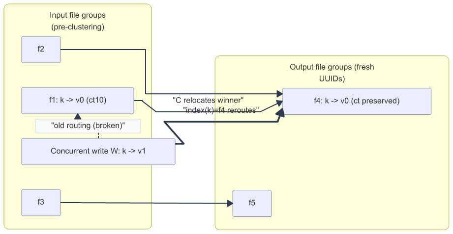
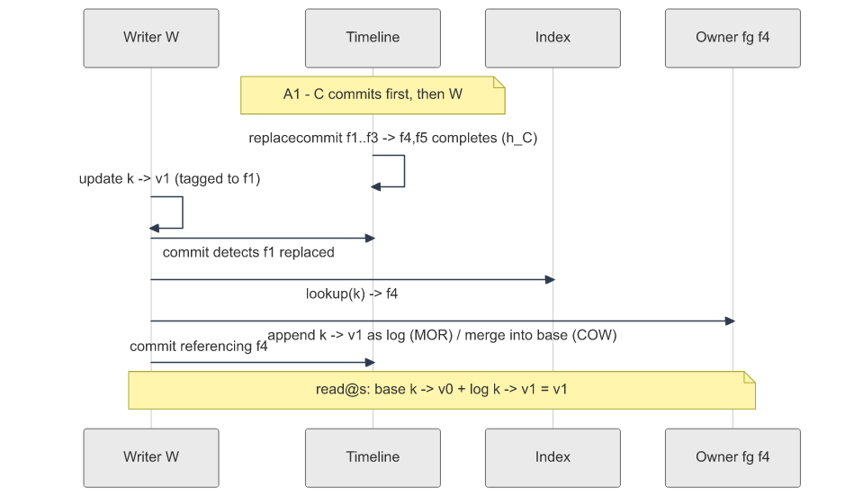
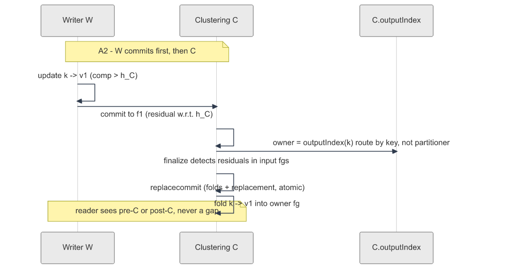
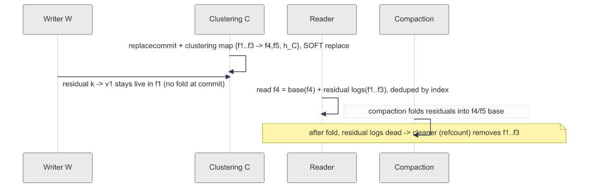
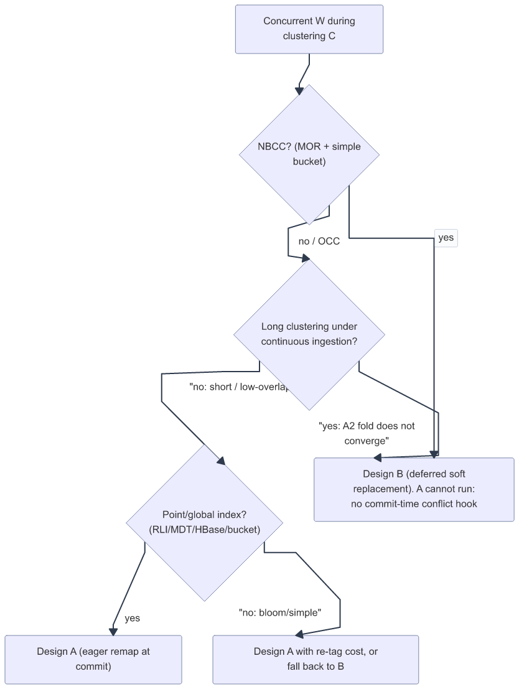

<!--
  Licensed to the Apache Software Foundation (ASF) under one or more
  contributor license agreements.  See the NOTICE file distributed with
  this work for additional information regarding copyright ownership.
  The ASF licenses this file to You under the Apache License, Version 2.0
  (the "License"); you may not use this file except in compliance with
  the License.  You may obtain a copy of the License at

       http://www.apache.org/licenses/LICENSE-2.0

  Unless required by applicable law or agreed to in writing, software
  distributed under the License is distributed on an "AS IS" BASIS,
  WITHOUT WARRANTIES OR CONDITIONS OF ANY KIND, either express or implied.
  See the License for the specific language governing permissions and
  limitations under the License.
-->
# RFC-108: Non-blocking updates during clustering

## Proposers

- @codope

## Approvers
 - @<approver1 github username>
 - @<approver2 github username>

## Status

JIRA: [HUDI-1045](https://issues.apache.org/jira/browse/HUDI-1045) (Epic: Non-blocking concurrency control; related: HUDI-1042, HUDI-8464)

Issue: <Link to GH feature issue>

> Please keep the status updated in `rfc/README.md`.

> Authoring note: this draft was prepared with AI assistance from a human-directed codebase
> exploration and has been adversarially self-reviewed (see revision history); the proposer stands
> behind every claim and citation.

## Abstract

Today Hudi cannot let a writer `W` update records while a clustering service `C` reorganizes the same
file groups — it only picks a loser (reject the write, roll back clustering, or abort at commit), and
in one case it can even **silently drop** a write that lands after a clustering replacecommit. This
RFC makes `W` and `C` **commute**: both complete, in either order, with snapshot isolation preserved
and minimal redone work.

The core observation is:

> **In Hudi, reconciliation is already commutative; only *routing* is broken by clustering.**

Hudi merges record versions by **completion time + ordering field**, and clustering preserves each
record's original `_hoodie_commit_time` (`preserveHoodieMetadata=true` by default). So a concurrent
update `W(k)` — which carries a strictly later commit/ordering value than `C`'s relocated copy of `k`
— *already* wins any merge it participates in. Clustering creates **no new version** of any key; it
only relocates the winning version into a new file group with a fresh UUID. The problem therefore
reduces to **making the routing of post-snapshot updates onto the new layout total and commutative**.

We adapt the *commutativity-over-coordination* principle of *Commutative Compaction* [1]. That work
repairs the analogous Iceberg conflict with a **positional** compaction map and explicitly notes
([1], §4) that Hudi identifies records **by key**, so
there is no positional reference to repair. But Hudi has a key reference Iceberg lacks: the **index**,
which clustering already rebuilds to point each key at its new file group. **The index is Hudi's
clustering map.**

**What this RFC asks reviewers to approve.** The *framing* (reconciliation is already commutative;
clustering breaks only *routing*; the index is the repair map) and the *phased plan* — not one
big-bang change. Phase 0a (the silent-drop guard + `h_C` in the clustering plan) is the first,
self-contained step; Phases 0b/1 add Design B for NBCC, Phase 2 adds Design A for OCC, and Phase 3 (a
new log-block type) is explicitly optional. You can endorse the direction and Phase 0a/1 without
committing to Phase 3.

## Background

### Clustering today (evidence)

- **Plan:** `ClusteringPlanActionExecutor` → `PartitionAwareClusteringPlanStrategy.generateClusteringPlan`
  (`:154`) selects latest file slices not already under pending compaction/log-compaction/clustering
  (`ClusteringPlanStrategy.getFileSlicesEligibleForClustering:123`), bins them into groups
  (`max.bytes.per.group`, default 2 GB) with `numOutputFileGroups = ceil(groupSize / target.file.max.bytes)`
  (`:268`). Requested instant action is `CLUSTERING` (table v2) or `REPLACE_COMMIT` (legacy).
  **The plan stores input file *paths*, not a logical input horizon** — the root of the HUDI-8464 gap.
- **Execute/commit:** `SparkExecuteClusteringCommitActionExecutor` →
  `MultipleSparkJobExecutionStrategy.performClustering` reads each input group via
  `HoodieFileGroupReader` with `withLatestCommitTime(instantTime)`, writes new groups with **fresh
  UUIDs** (`BulkInsertPartitioner.getFileIdPfx` → `FSUtils.createNewFileIdPfx`), then
  `commitClustering` sets `partitionToReplaceFileIds` = input fgs minus reused output fgs
  (`CommonClientUtils.getPartitionToReplacedFileIds:148`) and transitions to complete **under
  `txnManager.beginStateChange`** (`BaseHoodieTableServiceClient.completeClustering:607-628`). The
  Spark data write happens **outside** the lock; only the timeline transition is inside.
- **Index rebuild:** `executeClustering` calls `updateIndex` (`BaseCommitActionExecutor.java:306`).
- **Metadata preservation:** clustering runs with `preserveHoodieMetadata=true` by default
  (`PartitionAwareClusteringPlanStrategy.java:253`, `MultipleSparkJobExecutionStrategy.java:104`
  `.orElse(true)`), so the clustered copy of a key keeps its **original `_hoodie_commit_time`**.

### What happens on conflict today

- **Reject** (default `SparkRejectUpdateStrategy`): `W` fails with `HoodieClusteringUpdateException`
  (`SparkRejectUpdateStrategy.java:50-56`).
- **Rollback clustering** (`SparkAllowUpdateStrategy` +
  `hoodie.clustering.rollback.pending.replacecommit.on.conflict=true`): discards all of `C`'s work
  (`BaseSparkCommitActionExecutor.java:143-161`).
- **Abort at commit**: OCC intersects mutated file IDs and aborts
  (`SimpleConcurrentFileWritesConflictResolutionStrategy.java:140-207`; the `resolveConflict` comment
  at `:190-193` explicitly defers the fix to HUDI-1042 for the `CLUSTER` case, and the abort `throw`
  is at `:204-206`).
- **Silent drop (data loss):** replacement is tracked at *file-group* granularity
  (`fgIdToReplaceInstants: HoodieFileGroupId → replaceInstant`) and `isFileGroupReplaced(fg)` is a
  blanket boolean (`AbstractTableFileSystemView.java:1682`, used at `:707`). A slice written to a
  replaced fg at `t_W > t_C` is excluded from reads.

### The commutative-merge engine we reuse

- **Completion-time timeline (v8+):** completed instants are named `requestedTime_completionTime`
  (`InstantFileNameGeneratorV2.java:287`); `CompletionTimeQueryView` maps a log file's
  `deltaCommitTime` to the completion time used to place it in the right file slice
  (`HoodieFileGroup.getBaseInstantTime:129-148`).
- **NBCC:** `NON_BLOCKING_CONCURRENCY_CONTROL` (MOR + simple bucket index only, plus the metadata
  table — `HoodieWriteConfig.java:3837-3842`) lets multiple writers append log files to the **same** file
  group with **no commit-time conflict check** (`needResolveWriteConflict` returns false for non-bulk
  ops — `:3011-3032`, NBCC branch `:3019-3028`); readers reconcile by completion time + ordering field.
- **Merge:** `KeyBasedFileGroupRecordBuffer` merges base + log by record key; winner by
  `BufferedRecordMergerFactory` (commit-time → highest commit time; event-time → highest ordering
  value). Deletes via `HoodieDeleteBlock`/`DeleteRecord` applied by key.
- **Layout change is not a logical conflict.** [1] observes that anchoring the compaction-map
  reference near the table root lets `SERIALIZABLE` transactions ignore a conflict when a compaction
  only changed layout. Hudi has the analog for free: completion-time + ordering reconciliation already
  treats a clustering relocation as a **non-logical** change (no new version; preserved commit time),
  so a layout-only replacecommit need not force a read-conflict abort — the property this RFC builds on.

### Goals / Non-goals (from HUDI-1045)

| Goal | How addressed |
|---|---|
| Writes can be updates, deletes, or inserts | Update/delete = newer version, wins by merge. Insert of a new key = routed once, no base to conflict (see Correctness, edge cases). |
| Either `C` or `W` can finish first | Symmetric repair (A1: C-then-W, A2: W-then-C); commutativity theorem. |
| Both complete without much redo | Loser rebases only the **conflicting** records: MOR = O(conflicting records) log append; COW = bounded by overlap, not table size. |
| Output file-group count may differ from input | Output uses fresh UUIDs; per-key routing via index, not fg-to-fg mapping. |
| Oblivious to OCC vs NBCC | OCC → eager (Design A). NBCC → lazy (Design B), trivial there because bucket routing is deterministic. Shared correctness core. |
| Interplay with cleaning & compaction | Residual lifecycle defined; compaction folds residuals; cleaner reference counting (Design B). |
| **Non-goal:** strict sort order under updates | Residual updates are appended as log records, not re-sorted into clustered position. Accepted. |

We also **fix the silent-drop race** (blanket replacement) as a prerequisite (Phase 0).

### Why the paper's mechanism doesn't transfer verbatim

Iceberg transactions reference rows **positionally** `(file, pos)`; compaction maps remap
`(oldfile,oldpos)→(newfile,newpos)` so the loser rebases a tiny positional delete vector. Hudi
identifies records **by key**, so the unit of repair is the **(key → owner file group)** mapping —
and that mapping already exists as the **index**. We never remap positions; we re-route records to
file groups and let key-merge reconcile.

The paper [1] names this gap itself (§4, Related Work): *"Hudi writes identify records by key rather than
position, so there is no positional reference for a compaction map to repair. As with sort and z-order
rewrites in Iceberg, these techniques could apply to Hudi's reclustering operations, though at a
coarser granularity than row positions."* This RFC is the realization of that sentence: the "coarser
granularity" is the file group, and the "reference to repair" is the key→fg index.

**Not the same as the paper's "invert delta commits."** The paper ([1], §3.3) sketches inverting delta
commits — rewriting a past commit to reference the *future* compacted state (inserts → position
deletes via the map; deletes → inserts from the old base) — as a **space optimization** to reduce the
number of compacted states the table maintains. That is orthogonal to our A2 fold-cost problem. The
mechanism we reuse is the paper's core **rebase** (re-route the loser's records onto the committed
layout), not delta inversion.

## Implementation

### Shared core (both designs)

1. **Clustering input horizon `h_C`** (fixes HUDI-8464). The plan records an explicit completion-time
   horizon: `C`'s output reflects exactly the data with completion time `≤ h_C`. A write is a
   **residual** w.r.t. `C` iff it mutates one of `C`'s input fgs with completion time `> h_C`.
2. **Index as routing map.** Post-clustering, the index resolves `key → new owner fg ∈ {f4,f5,…}`.
   For brand-new inserted keys (absent at `h_C`), the owner is assigned by the same partitioner / a
   fresh fg.
3. **Reconciliation is free.** Any version that *participates* in the owner fg's merge is ordered
   correctly by completion-time + ordering field, because clustering preserved original commit times.

**One horizon, enforced everywhere (why `h_C` must be a single number).** `h_C` is a *completion time*,
and the whole design hinges on using the **same** `h_C` at three places: (a) planning — which input
slices `C` reads; (b) the residual test — which concurrent writes must be folded/merged; (c) the
read/guard path. If these use different clocks, a write can be "included" by one and "a residual" by
another, and fall through the crack. The trap is concrete: a clustering plan is *built* from a snapshot
at `h_C` but the replace instant is *requested* slightly later (`requestedTime`), so a write that
completes in the `(h_C, requestedTime]` window is a residual by definition yet is invisible to any
check keyed on `requestedTime`. Phase 0a's guard uses `requestedTime` today as a deliberately
*conservative* stand-in: it flags every write completing after `requestedTime` (the common post-plan
drop) while keeping replacement hard, but the narrow `(h_C, requestedTime]` sliver is a known blind
spot that **Phase 1 closes by keying all three points off the same `h_C`.** See Ex 10.

The design space is purely **when and how residual versions are made to participate** in the owner
fg's merge.

**Figure 1 — The core mechanism.** Clustering `C` relocates each key's winning version into a
fresh-UUID output fg (preserving `_hoodie_commit_time`); a concurrent write `W` still routes to the
old fg by stale layout, and the index re-routes it to the key's new owner fg.



### Design A — eager remap at commit (default for OCC + point index + short/low-overlap clustering)

Replace "abort on clustering overlap" with "remap, then commit." The **second** committer repairs.

**A1 — `C` commits first, then `W`.** At `W`'s commit, conflict resolution detects `W`'s mutated fgs
∩ `C`'s replaced fgs ≠ ∅. Instead of aborting, `W` **rebases** the affected records:

```
for each W record r with key k targeting a replaced fg:
    owner = index.lookup(k)        # ∈ C's output fgs; or fresh fg if k is a new insert
    re-tag r to owner
    MOR: append r as a log block to owner            # cheap, no base rewrite
    COW: merge r into owner's base file (new slice)   # bounded by overlap
W commits referencing the new owner fgs.
```

`W`'s completion `> h_C` and commit time `> C`'s preserved copy ⇒ `W` wins at read. Originals in the
replaced fgs stay excluded (correct — they were superseded). No reader sees a partial state: `W`'s
rebased writes and its commit are one atomic instant.

**Figure 2 — Design A, case A1 (`C` commits first, then `W`).**



**A2 — `W` commits first, then `C`.** `C`'s snapshot `h_C` predates `W`. At `C`'s finalize, `C`
detects residuals (writes to its input fgs with completion `> h_C`) and folds them into its output
before the replacecommit. **Residuals must be routed by key identity to `C`'s own output placement,
not by the partitioner.** `C`'s partitioner routes by clustering-column *value*; a residual that is an
update to an existing key `k` may carry a *changed* clustering-column value, so partitioner-routing
would send it to a different output fg than the one holding `k`'s base copy — producing the
cross-fg duplicate of Ex 6 (violating invariant I2). The correct routing exists: `executeClustering`
calls `updateIndex` **before** commit (`BaseCommitActionExecutor.java:306`), so `C`'s `key → output fg`
map is available at fold time. Rule:
```
for each residual record r with key k:
    if k ∈ C's output (existing key)  -> owner = C.outputIndex(k)   # same fg as k's base copy
    else (k is new to C, e.g. a post-h_C insert) -> owner = partitioner / fresh fg
    MOR: append r as a log block to owner ; COW: fold into owner's base
```
Folds are emitted as part of the same clustering commit that records replacement, so readers see
either pre-`C` (`W` visible in `f1..f3`) or post-`C` (`W` folded into `f4/f5`); never a gap.

**Figure 3 — Design A, case A2 (`W` commits first, then `C`).** Residuals are routed by key identity
(`C.outputIndex(k)`), not by the partitioner — see Ex 6 for the duplicate this prevents.



**A2 fold cost is the sharp edge (see Efficiency / liveness).** A "residual" is *every* committed
write to `C`'s input fgs over the whole `[h_C, commit]` window — under continuous ingestion this can
approach the table's churn during a long clustering, not a small delta. The fold is a data write
(`HoodieAppendHandle`) and must not be done while holding the `txnManager` lock for an unbounded
amount of work, and new residuals arriving during the fold create a TOCTOU. We therefore require an
**incremental, converging fold**: fold the bulk outside the lock; then under the lock fold only the
(small) delta committed since the last pass and commit; this converges iff ingestion-rate to the
input fgs < fold-rate. If it does not converge (sustained high-throughput ingestion to the clustered
fgs), Design A is the wrong tool for that table — use Design B, which makes A2 a no-op at commit.

**What A actually does at runtime when the fold won't converge.** "Use Design B" is a choice operators
make *ahead of time* by config; it is not an answer for a table already running A when ingestion
suddenly spikes. So the A2 fold is **bounded, not open-ended**: it makes at most `N` incremental passes
(configurable, e.g. 3), and if the residual delta fails to *shrink* across `N` passes — ingestion is
keeping pace with or outrunning the fold — `C` stops trying and **aborts/rolls back** (`rollbackInflightClustering`),
emitting a metric. Think of it as a mover who keeps packing a room while people keep bringing in more
boxes: after a few rounds with the pile still growing, they give up on *this* attempt rather than pack
forever. Crucially this sacrifices only **`C`'s** liveness (its work is discarded, exactly as a
rolled-back clustering is today) — never correctness, and never a stalled writer. It turns a potential
unbounded stall under the commit lock into a bounded, observable "clustering gave up, retry later." See
Ex 8.

**Why A needs no read-path/format change:** in both sub-cases residuals are *copied into* the new
owner fgs before/with replacement, so the existing hard-replacement + existing merge are already
correct. Complexity is localized to the write/commit path.

### Index requirement (routing-map availability)

Design A's remap presumes a **point-lookupable `key → file group` map**. That holds for the
record-level index (MDT), HBase index, and bucket index. It does **not** hold for bloom or simple
index, where "the index" *is* the file layout and resolving `k`'s new owner means re-probing the new
file groups' bloom filters / key ranges (a tagging operation, bounded but not O(1)).

| Index type | Routing map for remap | Design A applicability |
|---|---|---|
| Record-level index (RLI/MDT), HBase | Point lookup, free | Native fit |
| Bucket index (simple/consistent) | Deterministic key→bucket | Native fit; also the NBCC/Phase-1 case |
| Bloom / simple index | None — must re-tag against new layout | A works but rebase pays a tag cost; or fall back to Design B |

This makes "the index is Hudi's clustering map" precise: it is a *cheap* map only for global/point
indexes; for derived indexes the remap cost rises and Design B (deferred, no per-key write-time
lookup) may be preferable.

**Why no separate map artifact is needed when a point index is present.** The paper's repair computes
a remapping join (`positions ⋈ file_mappings ⋈ runs`) and persists it as a compaction-map artifact.
In Hudi that join is already materialized: clustering **reads every input record**, so it emits the
exact `key → new fg` set as a byproduct — there is no irrelevant range to prune — and bulk-writes it
into the index (RLI/MDT). The index *is* the materialized routing map, so for point/global indexes a
separate `fg → fg` (or key→fg) artifact would be **redundant** with data the index already holds. A
standalone artifact earns its keep only when (a) there is no point/global index — bloom/simple, where
routing means re-probing the new layout — or (b) re-routing through the artifact is measurably cheaper
than an index probe (e.g. a coarse `fg → fg` map for bulk group-level pruning). Absent those, use the
index. This is the row-id indirection the paper flags in [1], §4, taken to its conclusion for key-addressed
tables.

### Design B — deferred soft replacement (default for NBCC, streaming & long-running clustering)

`C` commits the replacecommit **plus** a *clustering map* `{input fgs → output fgs, h_C}` and marks
replacement **soft**: a replaced fg's slices with completion `> h_C` remain **live residuals**. No
repair at commit.

**Figure 4 — Design B (deferred soft replacement).** Cost moves off the commit path to bounded read
amplification, amortized by compaction.



- **Read:** the file-system view treats a clustering group `{f1,f2,f3 → f4,f5}` as one merge unit
  during the transition; reading `f4` merges `base(f4)` + residual logs of `f1,f2,f3`, deduped by key
  across the group, each key emitted only from its owner fg (resolved via index). Correct, but reads
  the group's residuals (amplification) until compaction.
- **Compaction:** folds residuals into `f4/f5` base; afterwards the residual logs in `f1,f2,f3` are
  dead.
- **Cleaning:** `f1,f2,f3` may be cleaned only once their residuals are folded everywhere that
  references them — needs **reference counting** (a residual log may feed multiple output fgs).
- **Format:** either the JIRA's *pointer data block* + *retain command block*, or (lighter) a
  clustering-map artifact in the replacecommit + completion-time-aware FSV. Note the JIRA's
  hash-split-of-inserts idea is correct for *new* keys only; **updates to existing keys must route by
  the index** to the key's actual base owner, else a key whose clustered base is in `f5` but whose
  residual update lands via `f1` would appear in both `f4` and `f5` (duplicate).

**B's liveness caveat — the mirror image of A's fold.** B is not free of a convergence condition; it
just *relocates* it from commit-time to compaction. Residuals pile up in the old fgs until a compaction
folds them, so every read of the group re-reads that pile. If compaction falls behind ingestion the
pile — and read latency — grow without bound. Symmetrically to A: **B converges iff compaction-rate ≥
residual-accrual-rate.** Where A can *abort* to stay safe, B has no commit-time knob, so the mitigation
is scheduling: **prioritize compaction of residual-bearing clustering groups** (they carry the live
read tax) ahead of ordinary compactions, capping the overlay each reader pays. Left starved, B degrades
exactly like any un-compacted hot MOR file group does today — bounded by the operator's compaction
cadence, not by this design. See Ex 9.

**Why B is not optional for NBCC (adoption note).** B's read-path change (a group-scoped merge in the
file-system view) is a real adoption cost — reject/rollback today and Design A both leave readers
untouched, which is the easier sell. But A and B **partition by concurrency-control regime, not by
ambition**, and under NBCC the choice is not free:

- Design A repairs *inside commit-time conflict resolution* (A1 re-tags the loser's records; the hook
  lives on the conflict-resolution path). Under NBCC, non-bulk ingestion returns `false` from
  `needResolveWriteConflict` (`HoodieWriteConfig.java:3011-3032`, NBCC branch `:3019-3028`) — writers
  append to the same file group with **no commit-time conflict check at all**. There is therefore **no
  coordination point at which A1 could fire**: A is not merely more expensive under NBCC, it is
  *structurally absent*. B, which repairs at read/compaction with no commit-time coordination, is the
  only correct design there.
- The same is true for long-running clustering under continuous ingestion even on OCC tables: A2's
  fold ≈ the churn to the input fgs over the whole `[h_C, commit]` window, which need not converge (see
  Efficiency / liveness). There too B is the correct tool, not a fallback.

So B's reader cost is unavoidable precisely where it is needed; the adoption tradeoff is real for
OCC + point-index tables (where A avoids it) and moot for NBCC/streaming (where A cannot run).

### Recommendation & comparison

**The repair *timing* should follow the regime, not a single global winner.** Recommend:
**Design A (eager remap) for OCC tables with a point index and short / low-overlap clustering
windows**; **Design B (deferred) for NBCC, for high-throughput streaming, and for long-running
clustering under continuous ingestion** — i.e. wherever the A2 fold cannot be kept small. A is the
lower-complexity default (no format/read change) and should be the first thing built (Phase 2); B is
not a fallback but the *correct* design for the regimes where A's A2 fold does not converge.

**Figure 5 — Choosing the repair timing per regime.**



| Dimension | A (eager remap) | B (deferred) |
|---|---|---|
| Stack layer touched | L3 write/commit only | **L1/L2** (log-format block + table-format replacement + reader) |
| Storage format change | **None** | New block/artifact + soft replacement |
| Read-path change | **None** | Group-scoped merge; read amplification until compaction |
| Cleaner change | Minimal | Reference counting |
| Redo cost (MOR) | O(conflicting records) log append | ~0 at commit (paid at read/compaction) |
| Redo cost (COW) | Bounded base rewrite of touched output fgs | ~0 at commit (paid at read/compaction) |
| **Long clustering + continuous ingestion** | **A2 fold ≈ window churn; needs converging incremental fold; may not terminate** | **Handled natively — A2 is a no-op at commit** |
| Index requirement | Point-lookupable (RLI/HBase/bucket); else re-tag cost | None at write time |
| Non-blocking-ness | Repairs under existing commit lock | Fully non-blocking |
| Streaming (Flink, NBCC) | Not applicable — NBCC ingestion skips conflict resolution | **Natural** |
| Correctness surface | Small (write/commit path) | Larger (read + cleaner + format) |

Rationale: A keeps the core stable (no file-format churn) and reuses the merge engine unchanged, so it
is the cheapest correct option *when the A2 fold is small*. But the A2 fold scales with ingestion over
the clustering window and runs partly under the commit lock; for long clusterings or streaming it does
not stay small, and there A is the wrong tool. B pays that cost lazily at read/compaction with no
commit-time coordination, at the price of file-format and read-path changes. NBCC forces B regardless,
because ingestion under NBCC never enters conflict resolution, so A1's remap hook cannot fire.

### Correctness (snapshot isolation & commutativity)

**Invariants.** The design must preserve, for any interleaving of `W`, `C`, compaction and cleaning:
- **I1 — No lost update:** every committed version is visible at horizons ≥ its completion unless superseded.
- **I2 — Uniqueness (strong):** a snapshot read returns exactly one version per key — no key in two file groups — even under value-changing updates, multiple writers, and mid-transition reads.
- **I3 — Snapshot isolation:** readers see a consistent cut; no partial commits.
- **I4 — Both-complete liveness (strong):** neither `W` nor `C` is forced to abort/rollback under sustained concurrency.
- **I5 — No resurrection:** clustering relocating a pre-delete value never undoes a committed delete.
- **I6 — Index/layout agreement:** the index points each key at its physical owner fg.

I1/I3/I5 follow from the theorem below; **I2 is the one Design A's A2 path can violate if residuals
are mis-routed (Ex 6); I4 is the liveness invariant that A's A2 fold (under continuous ingestion) and
B's compaction backlog can each strain** — both are given explicit bounds and runtime guards
(A: bounded-abort, Ex 8; B: compaction-priority, Ex 9). I5 additionally depends on the single-`h_C`
reference point (Ex 10).

**Model.** A logical record key `k` has versions, each `(value, ct = _hoodie_commit_time, o =
ordering value, comp = completion time)`. A **snapshot read at horizon `s`** returns, per key, the
version with the largest `comp ≤ s`, winner by ordering rule (commit-time: max `ct`; event-time:
max `o`, ties by `ct`). This is Hudi's existing contract for serial writes; we must preserve it under
concurrency.

**Lemma 1 (reconciliation is commutative).** Given any *set* of versions of `k` all visible to a
reader, Hudi's completion-time + ordering merge returns the same snapshot-winner regardless of the
order the versions were produced or physically arranged. *(Existing behavior:
`KeyBasedFileGroupRecordBuffer` + `BufferedRecordMergerFactory`.)*

**Lemma 2 (clustering preserves versions).** With `preserveHoodieMetadata=true`, `C` relocates the
snapshot-winner of each input key as of `h_C` into an output fg with identical `(value, ct, o)`. `C`
introduces no new version and changes no winner among versions with `comp ≤ h_C`. *(If clustering
restamped `ct = t_C` or the ordering value, this fails and SI could break — hence preservation is a
hard requirement, asserted/tested by this RFC.)* The **mechanical** winner between `C`'s copy and a
residual depends on the merge mode. `C` writes its output as **base files**
(`SparkSortAndSizeExecutionStrategy:97`, `CreateHandleFactory`) and a residual arrives as a **log** on
the same fg. Under **commit-time** ordering the log always wins (it is the newer commit) — the residual
overlays the base. Under **event-time** ordering the winner is whoever has the higher ordering value
`o`, which may be *either* the base or the log: a late residual with `o_W < o_existing` is correctly
**rejected**, precisely because `C` preserved the original `o` on its relocated copy. In both modes
`KeyBasedFileGroupRecordBuffer`'s final-merge returns the same winner it would have without clustering
— which is the point.

**Lemma 3 (routing totality after repair).** After the repair (A) or with soft replacement (B), for
every version `v` of `k` produced by any residual write (`comp > h_C`), `v` participates in the merge
of exactly one fg — the owner of `k` — and the pre-clustering originals of `k` (`comp ≤ h_C`) are
either represented by `C`'s relocated copy (existing key) or excluded without loss. No version is
double-counted (no cross-fg duplicate) and none is dropped.
- *Design A:* in A2 (`C` second) residuals are copied into the owner fg **atomically with `C`'s
  replacecommit**; in A1 (`W` second) they are copied **atomically with `W`'s own commit**, on top of
  the already-replaced layout. Either way each residual lands in exactly one owner fg, and the
  pre-clustering originals are safely hard-replaced.
- *Design B:* originals are soft-replaced (still readable as residuals) and routed to the owner fg by
  index/group dedup.

**Theorem (SI preserved; `W` and `C` commute).** For any interleaving of `W` (completion `c_W`) and
`C` (completion `c_C`) and any reader horizon `s`, the read result equals a serial schedule in which
`C` is a layout no-op and `W` is applied as an update to the base table. *Proof:* fix `k`.
- If no residual touched `k`: by Lemma 2 the owner fg holds the snapshot-winner ≤ `h_C`; result
  unchanged.
- If `W` produced version `v_W` of `k`: by Lemma 3 `v_W` participates in the owner fg's merge
  alongside `C`'s relocated copy (if any). By Lemma 1 the merge returns the snapshot-winner of the
  *full* version set — identical to the serial schedule. Commit order only changes *who* performs the
  copy/route (A1 vs A2) or *when* the merge happens (B), not the per-key version set, so both orders
  yield the same result. ∎

**Edge cases.**
- **Deletes:** a delete is a version (`HoodieDeleteBlock`/`DeleteRecord` with ordering); routed and
  merged like any update.
- **Inserts of new keys (absent at `h_C`):** no base anywhere ⇒ no cross-fg duplicate; assign a
  single owner fg (partitioner/fresh fg) ⇒ appears exactly once.
- **`W` spans replaced and non-replaced fgs:** partition `W`'s records; only the replaced subset is
  rebased.
- **Multiple concurrent `W`s:** each rebases independently; Lemma 1 composes over any number of
  versions.
- **`C` overlaps compaction on the same fgs:** plan eligibility already excludes fgs under pending
  compaction (`getFileSlicesEligibleForClustering:123`); residual folding is ordered by completion
  time so a later compaction subsumes earlier residuals.
- **Rollback:** if the second committer aborts after partial rebase, its instant's markers reconcile
  (`HoodieTable.finalizeWrite`/`reconcileAgainstMarkers:794`) and nothing is exposed (atomicity).
  Failed `C` rolls back via `rollbackInflightClustering:675` (+ optional heartbeat expiry,
  `ENABLE_EXPIRATIONS`); `W` is unaffected.

### Worked examples

Notation: `ctN` = commit time, `compN` = completion time, `h_C` = clustering input horizon.

**Ex 1 — MOR, C-then-W (A1), update to existing key.**
`f1` has `k→v0 (ct10)`. `C` plans `h_C=20`, writes `f4` with `k→v0 (ct10 preserved)`, replaces `f1`,
completes `comp30`. `W` updates `k→v1 (ct40)`, tagged to `f1`. At `W` commit: detect `f1` replaced;
`index(k)=f4`; append `k→v1` as a log on `f4`; commit `comp50`. Read@`s≥50`: `f4` = base `k→v0(ct10)`
+ log `k→v1(ct40)` → **v1**. No data loss, no rollback, one log append.

**Ex 2 — MOR, W-then-C (A2), delete + insert.**
`f1`: `k1→v0(ct10)`, `k2→v0(ct10)`. `W` (`comp15`, after `C`'s `h_C=12`): delete `k1`, insert new
`k9→v9(ct15)`, tagged to `f1`. `C` finalize detects residuals in `f1` (`comp15 > h_C=12`): routes
`k1`-delete and `k9` by partitioner → `delete k1` log on `f4`, `k9` on (say) `f5`; writes
`f4{k1→v0,k2→v0}`, `f5{...}`, replaces `f1`, commits atomically. Read: `k1` deleted (delete log
newer), `k2→v0`, `k9→v9` appears once in `f5`.

**Ex 3 — the duplicate hazard, avoided.**
`C` sorts so `k`'s clustered base lands in `f5`. `W` updates `k→v1` via `f1`. Owner routing uses
`index(k)=f5` ⇒ residual goes to `f5` ⇒ single version. A naive *hash-split* of residuals (JIRA
Approach-2 insert trick) would send `k` to `hash(k)%2 = f4`, while base is in `f5` ⇒ `k` in **both**
(duplicate). This is why **updates must route by index, not by hash** (applies to Design B too).

**Ex 4 — COW cost.**
Same as Ex 1 but COW: `W` must read `f4`'s base and write a new base slice for `f4` merging `k→v1`.
Cost = rewrite of the touched output base file(s), bounded by overlap — not the table. Compare to
today: `W` aborts and redoes its entire batch, or `C` is rolled back (all clustering wasted).

**Ex 5 — lifecycle (Design B).**
`C` soft-replaces `f1`; residual `k→v1` stays in `f1`, read via `f4`. Next compaction of `f4` folds
`k→v1` into `f4` base. Reference count of `f1`'s residual drops to 0 once all owner fgs (`f4`, `f5`)
that referenced it are compacted; cleaner may then remove `f1`.

**Ex 6 — A2 duplicate hazard (failure trace) and its fix.**
MOR, event-time ordering, `C` sorts by `city`; a value-changing update. This is the trace that
mis-routing produces — included so reviewers see the bug the routing rule prevents.

| # | actor | state before | action | state after |
|---|---|---|---|---|
| 1 | — | `f1: k→{city=Newark, ts=5}` (ct10) | `C` plans, `h_C=20`, ranges `f4=A–M`, `f5=N–Z` | plan fixed |
| 2 | `C` | — | bulk-insert base; `Newark`∈N–Z → `f5` | `f5` base: `k(Newark,ts5)` |
| 3 | `W` | `f1` live | update `k→{city=Boston, ts=25}` ct30, tag→`f1`, commit | `f1` log: `k(Boston,ts25)` comp35 |
| 4a | `C` | `f5` base has `k` | **WRONG: fold residual by partitioner** — `Boston`∈A–M → `f4` | `f4` log `k(Boston)`; `f5` base still `k(Newark)` |
| 5a | reader | — | snapshot read | **`k` twice: `f4(Boston)` + `f5(Newark)`** ❌ I2 |
| 4b | `C` | `f5` base has `k` | **RIGHT: `C.outputIndex(k)=f5`** → fold into `f5` | `f5`: base `k(Newark)` + log `k(Boston)` |
| 5b | reader | — | snapshot read | `k→Boston` once ✔ (log overlays base) |

**Ex 7 — crash mid-rebase (A1), atomicity.**
`C` committed (`f1` hard-replaced). `W` rebases `k→v1` as a log on `f4`, then the executor dies before
`W`'s commit. The `f4` log carries `W`'s (uncommitted) instant time; readers filter blocks from
non-completed instants, so the partial log is invisible (I3 held). `W`'s rollback reconciles via
markers (`reconcileAgainstMarkers:794`), deleting the orphan `f4` log even though `f4` is not `W`'s
"own" original fg (rollback uses `W`'s write stats, which list `f4`). No lost or duplicated data.

**Ex 8 — A2 fold under an ingestion spike: bounded abort.**
MOR, OCC, Design A configured, `N=3` fold passes allowed. `C` clusters `f1..f3` at `h_C=100`. While
`C` finalizes, a streaming job appends ~50k updates/s to `f1`. Pass 1 folds the 2.0M residuals
gathered so far (outside the lock); 1.5M new ones arrive during it. Pass 2 folds 1.5M; 1.4M arrive.
Pass 3 folds 1.4M; 1.4M arrive — the delta has stopped shrinking. `C` **aborts**:
`rollbackInflightClustering` discards `C`'s output, `f1..f3` stay live and un-clustered, ingestion is
untouched, and `clustering.fold.aborted` fires. No writer stalled, nothing lost — clustering just
retries later (or the table is switched to Design B, where this fold is a no-op). Contrast today: the
*writer* is rejected or `C` is silently rolled back with no signal.

**Ex 9 — Design B when compaction falls behind.**
NBCC, Design B. `C` soft-replaces `f1..f3 → f4,f5` at `h_C=100`; ingestion keeps appending to the group
at 10k rec/s. A read of `f4` must merge `base(f4)` + every residual newer than `h_C`: ≈600k records of
overlay at t+1 min, ≈6M at t+10 min, and climbing while no compaction has folded them. Read latency
degrades linearly — **B converges only if compaction folds at ≥ the accrual rate.** Mitigation: the
scheduler compacts residual-bearing groups first (they carry the live read tax), capping each reader's
overlay. Starved indefinitely, B degrades exactly like any un-compacted hot MOR fg today — bounded by
operator compaction cadence, not by this design.

**Ex 10 — the `h_C` vs `requestedTime` window.**
`C`'s plan is built from a snapshot whose newest completed write has completion time `h_C=100`. Building
and requesting the replace instant takes a moment, so its `requestedTime=105`. A concurrent write `W`
on `f1` completes at `comp=103` — inside `(h_C=100, requestedTime=105]`. By definition `W` is a
**residual** (`103 > h_C=100`), so it must be folded (A) or kept as a live residual (B). But a check
keyed on `requestedTime=105` sees `103 < 105` and would *not* flag it — the blind spot. This is exactly
why Phase 1 anchors planning, the residual test, and the read path to the **same `h_C`**. Until then
Phase 0a still catches the common case (drops completing after `requestedTime`) and keeps replacement
hard; the `(h_C, requestedTime]` sliver is the residual Phase 1 closes. One clock, one horizon,
everywhere.

### Efficiency

- **MOR, A1 (`W` second):** repair = serialize `W`'s conflicting records into one log block per owner
  fg — O(`W`'s conflicting records), no base read/rewrite. Bounded by `W`'s own batch; the Hudi analog
  of the sub-second rebase reported in [1].
- **MOR, A2 (`C` second):** fold = O(residuals in `[h_C, commit]`) — **bounded by ingestion to the
  input fgs over the whole clustering window, not by a single batch.** Small for short/low-overlap
  clustering; potentially large under continuous ingestion (the case that should use Design B). Must be
  an incremental converging fold (see A2), with only the final small delta folded under the lock.
- **COW (A):** repair = re-merge conflicting records into touched output base files — O(conflicting
  records + bytes of touched output fgs). Inherent (no logs to absorb updates); bounded to *only the
  touched output fgs*, far cheaper than today's full-batch abort/redo or full-clustering rollback.
- **Read (A):** zero amplification — one version per key in the new layout.
- **Read (B):** amplification ∝ residual size of the clustering group, decaying to zero after
  compaction; ingestion commit cost ~0 (the A2 cost is moved off the commit path entirely).

### Interplay with other services

- **Compaction:** folds residuals (B) or normal logs (A) by completion time; ordering guarantees no
  lost residual. Plan eligibility already excludes fgs in pending clustering.
- **Cleaning:** A → unchanged (originals safely hard-replaced after copy). B → reference-counted
  retention of residual-bearing input fgs until folded.
- **Metadata table (MDT):** `partitionToReplaceFileIds`, `files`/`column_stats` partitions and the
  index must reflect rebased writes; MDT is itself MOR + NBCC, so the same merge applies. Verify
  record-index updates point rebased keys at owner fgs.
- **HUDI-8464:** the explicit `h_C` in the plan closes the request-time-vs-data gap; planning must
  anchor input selection to `h_C`.

### Phasing & concrete changes

**Phase 0a — Detect & fail loud on the silent-drop race (safe; keeps hard replacement).**
- `AbstractTableFileSystemView` (`:275-311` `resetFileGroupsReplaced`, `:1682-1715`
  `isFileGroupReplaced*`): add a guard/assertion + metric that fires when a *live* slice (a committed
  slice newer than the replace instant's **`requestedTime`** — a deliberately conservative stand-in for
  `h_C`; see Ex 10) exists under a hard-replaced fg, instead of silently excluding it. This is a
  pure detection change — replacement stays **hard**, so non-concurrent clustering is unaffected and
  Design A's correctness basis (Lemma 3) is preserved.
- `HoodieClusteringPlan` (avro, `hudi-common/.../avro/model`): add `inputHorizonCompletionTime`,
  populated in `PartitionAwareClusteringPlanStrategy.generateClusteringPlan:154`, so "residual" is
  well-defined (closes HUDI-8464).
- Tests: `TestHoodieTableFileSystemView` + new `TestClusteringWithConcurrentUpdates` reproducing the
  drop (now an assertion failure, not data loss).

**Phase 0b — Completion-time-aware (soft) replacement read path (scoped to Design B / NBCC only).**
- Introduce the soft-replacement predicate as a *separate* code path gated to NBCC/Design-B tables,
  so it never changes read semantics for OCC/Design-A or non-concurrent clustering. Design A keeps the
  hard-replacement path from 0a.

**Phase 1 — MOR + simple bucket index + NBCC (Design B, trivial routing).**
- Soft-replacement read path in `AbstractTableFileSystemView`/`HoodieTableFileSystemView` keyed on
  `h_C` and completion time; group/bucket-scoped merge feeding `HoodieFileGroupReader`. Reuse
  `CompletionTimeQueryView` and `KeyBasedFileGroupRecordBuffer` unchanged.

**Phase 2 — General OCC, COW + MOR (Design A). Full HUDI-1045.**
- New `UpdateStrategy` impl (e.g. `SparkRemapUpdateStrategy`) replacing reject/abort: re-tag via index
  and emit to owner fgs. Wire in `BaseSparkCommitActionExecutor.clusteringHandleUpdate:116-119`.
- Extend `ConflictResolutionStrategy.resolveConflict` (the clustering branch in
  `SimpleConcurrentFileWritesConflictResolutionStrategy.java` — comment `:190-193`, abort `throw`
  `:204-206`) to remap-not-abort.
- Shared `RebaseHelper`: input = conflicting records + index + table type; output = writes to owner
  fgs (MOR append via `HoodieAppendHandle`; COW merge via `HoodieMergeHandle`). Invoked from ingestion
  (A1) and from `commitClustering`/`completeClustering` finalize (A2,
  `BaseHoodieTableServiceClient.java:570-628`).

**Phase 3 (optional) — Design B for general/streaming.**
- `HoodieLogBlockType.POINTER_DATA_BLOCK` + `HoodieCommandBlockTypeEnum.RETAIN_BLOCK` (append-only at
  enum end — `HoodieLogBlock.java:168`), reader support in `HoodieLogFileReader.readBlock` +
  `AbstractHoodieLogRecordScanner`, cleaner reference counting. Unknown block ordinals throw
  (`HoodieLogFileReader.tryReadBlockType:238`), so this is table-version-gated and breaking for old
  readers — gate behind `HoodieTableVersion`.

## Rollout/Adoption Plan

- Off by default; enabled via the update-strategy config + a table-version/capability gate. OCC tables
  use Design A; NBCC (MOR + simple bucket index) tables use Design B. Existing reject/rollback
  behaviors remain selectable.
- No migration needed for Phases 0–2 (no storage-format change). Phase 3 is table-version-gated and
  breaking for old readers, so it is opt-in on new table versions only.

## Test Plan

- **Correctness/race:** deterministic interleavings (C-then-W, W-then-C) for COW & MOR, asserting no
  lost update, no duplicate, correct winner under commit-time and event-time ordering; delete and
  new-insert cases; multi-writer.
- **Property/fuzz:** randomized schedules of `W`/`C`/compaction/clean compared against a serial oracle
  (the Theorem's serial schedule).
- **Efficiency:** MOR rebase (log append) vs COW rebase vs today's abort/rollback; read-amplification
  decay across compaction (Design B).
- **Liveness bounds:** (A) A2 fold under sustained ingestion aborts within `N` passes and rolls back
  cleanly, leaving the writer unaffected (Ex 8); (B) read amplification stays bounded when
  residual-bearing groups are compaction-prioritized, and degrades gracefully (not incorrectly) when
  compaction is starved (Ex 9).
- **Horizon consistency:** a write completing in the `(h_C, requestedTime]` window is treated as a
  residual by planning, the residual test, and the read path alike (Ex 10).
- **Integration:** Spark + Flink (NBCC) end-to-end; MDT consistency (record index points rebased keys
  at owner fgs); rollback/heartbeat-expiry of failed `C` with in-flight `W`.

## Open questions

1. Event-time ordering + late residual data: confirm "participates in merge" suffices (it does, by
   Lemma 1) and add explicit tests for `o_W < o_existing`.
2. A2 routing of residuals whose clustering-column value changed: accepted as non-goal (sort), but
   confirm owner assignment stays single-valued per key.
3. Should Phase 2 always prefer MOR-style log append on COW tables' clustering output to avoid the
   base rewrite? Trade-off: read merge vs write cost.
4. Exact MDT record-index update path for rebased keys under both designs.

## References

[1] *Commutative Compaction.* 1st International Workshop on Data FORMATS for Modern Architectures and
    Workloads (FORMATS '26). https://doi.org/10.1145/3802514.3809174
[2] HUDI-1045 — Support updates during clustering. https://issues.apache.org/jira/browse/HUDI-1045
[3] HUDI-1042 — Concurrent updates for CLUSTER. https://issues.apache.org/jira/browse/HUDI-1042
[4] HUDI-8464 — Clustering request-time gap (plan stores input paths, not a logical horizon).
    https://issues.apache.org/jira/browse/HUDI-8464
